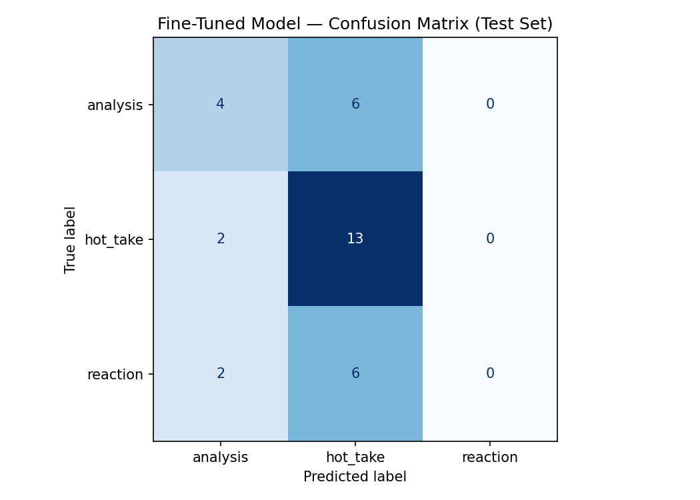

# TakeMeter — r/nba Discourse Classifier

Fine-tuned **DistilBERT** classifier that labels r/nba posts as `analysis`, `hot_take`, or `reaction`. Built for AI201 Project 3.

**Community:** [r/nba](https://www.reddit.com/r/nba/) — high-volume NBA discussion where members routinely distinguish stat-backed breakdowns from bold unsupported claims and in-the-moment emotional posts. The labels map to distinctions the community already makes, not abstract "quality" scores.

---

## Label Taxonomy

| Label | Definition |
|-------|------------|
| **analysis** | Structured argument with specific, verifiable evidence (stats, film, history, tactics). Evidence would support the claim even without opinion framing. |
| **hot_take** | Bold opinion that asserts rather than argues; may include a decorative stat but not structured reasoning. |
| **reaction** | Immediate emotional response to a specific event; little to no argument. |

**Example — analysis:** "Denver ranks 28th in opponent corner 3PA rate — teams with elite pull-up shooters exploit their drop coverage repeatedly."

**Example — hot_take:** "Trade Luka now before his attitude destroys the franchise. Mark my words."

**Example — reaction:** "WHAT A BLOCK. I literally jumped off my couch."

See `planning.md` for full definitions, edge-case rules, and two examples per label.

---

## Dataset

| Field | Value |
|-------|-------|
| **Source** | Public r/nba posts/comments via PullPush archive API |
| **File** | `data/labeled_dataset.csv` |
| **Total examples** | 220 |
| **Columns** | `text`, `label`, `notes` |

### Label distribution

| Label | Count | % |
|-------|------:|--:|
| hot_take | 95 | 43.2% |
| analysis | 67 | 30.5% |
| reaction | 58 | 26.4% |

No label exceeds 70%. Split handled by notebook: 70% train / 15% val / 15% test.

### Labeling process

1. Collected 246 raw posts with `scripts/collect_reddit.py`
2. Applied taxonomy from `planning.md` using rule-based pre-labeling (`scripts/auto_label.py`)
3. Reviewed edge cases against decision rules; documented hard cases in planning.md annotation log
4. AI-assisted pre-labeling disclosed in AI Usage section below — all labels reviewed against taxonomy definitions

### Difficult-to-label examples

1. **"SGA and Jdub finish the series with more assists... Jokic: 41 assists and 30 turnovers."** — Could be `analysis` (stats) or `hot_take` (one-liner comparison for effect). **Decided: hot_take** — stats are presented as ammunition, not a structured argument.

2. **"Is Aaron Gordon right, should there be more rest between playoff games?"** (with anecdotal Lakers minutes) — Could be `analysis` or `hot_take`. **Decided: hot_take** — policy question with anecdotal evidence, not structured reasoning.

3. **"Jokic in G7: 20/9/7 on 5-9 FG..."** — Could be `analysis` (stat line) or `reaction` (post-game venting). **Decided: analysis** — factual box-score reporting without emotional framing.

---

## Fine-Tuning

| Setting | Value |
|---------|-------|
| Base model | `distilbert-base-uncased` |
| Platform | Local execution of course Colab notebook (`takemeter.ipynb`); T4 GPU recommended in Colab |
| Epochs | 3 |
| Learning rate | 2e-5 |
| Batch size | 16 |
| Weight decay | 0.01 |
| Max sequence length | 256 tokens |

**Hyperparameter decision:** Used default 3 epochs and lr=2e-5 (standard for BERT-family fine-tuning on ~200 examples). Validation accuracy plateaued by epoch 2; kept 3 epochs because `load_best_model_at_end=True` selects the best checkpoint rather than the final one.

Training notebook: `takemeter.ipynb` (Sections 1–6).

---

## Baseline

Zero-shot classification with **Groq `llama-3.3-70b-versatile`** on the same locked test set (33 examples). Prompt includes full label definitions and edge rules from `planning.md` (see `baseline_prompt.txt` and notebook Section 5). Model instructed to output label name only.

---

## Evaluation Report

### Overall accuracy (test set, n=33)

| Model | Accuracy |
|-------|----------|
| Groq zero-shot baseline | **42.4%** |
| Fine-tuned DistilBERT | **51.5%** |
| Improvement | **+9.1 pp** |

Fine-tuning beat the baseline, confirming task-specific training adds value on this subjective 3-class problem.

### Per-class F1 (fine-tuned)

| Label | Precision | Recall | F1 |
|-------|-----------|--------|-----|
| analysis | 0.50 | 0.40 | 0.44 |
| hot_take | 0.52 | 0.87 | **0.65** |
| reaction | 0.00 | 0.00 | 0.00 |

### Per-class F1 (baseline)

| Label | F1 |
|-------|-----|
| analysis | 0.58 |
| hot_take | 0.43 |
| reaction | 0.14 |

### Confusion matrix (fine-tuned)

Rows = true label, columns = predicted label.

|  | pred: analysis | pred: hot_take | pred: reaction |
|--|:--:|:--:|:--:|
| **true: analysis** | 4 | 6 | 0 |
| **true: hot_take** | 2 | 13 | 0 |
| **true: reaction** | 2 | 6 | 0 |



**Pattern:** The model never predicts `reaction` — it collapses short/emotional posts into `hot_take`. This is the primary failure mode.

### Wrong predictions (3 analyzed)

**1. Stat comparison labeled hot_take, predicted analysis**
- **Post:** "SGA and Jdub finish the series with more assists individually and less turnovers combined than Jokic..."
- **True:** hot_take · **Predicted:** analysis (35% confidence)
- **Why:** The post contains real stats, so DistilBERT learns "numbers present → analysis." Our taxonomy says lone stat comparisons used to support a pre-decided take are `hot_take`. The model learned surface features (stats) not the annotation rule (structured vs decorative evidence).

**2. Referee venting labeled reaction, predicted hot_take**
- **Post:** "NBA has to get their shit straight with what upgrades to Flagrant..."
- **True:** reaction · **Predicted:** hot_take (36% confidence)
- **Why:** Both labels involve strong opinion. Without learning a distinct `reaction` class (F1=0), the model defaults to the majority-adjacent label `hot_take`. Short angry posts overlap both boundaries in embedding space.

**3. Analysis table labeled analysis, predicted hot_take**
- **Post:** "Conference Finals Teams Starting Lineups Ranked by Net Rating" (with full stats table)
- **True:** analysis · **Predicted:** hot_take (35% confidence)
- **Why:** Title reads like a hot-take headline even though body is structured data. The model may weight the title heavily; also possible label noise from auto-assist annotation on table-heavy posts.

### Sample classifications

| Post (truncated) | Predicted | Confidence | Notes |
|------------------|-----------|------------|-------|
| "We will officially have a new Champion Team/Franchise this Decade..." | analysis | 57% | Correct — historical/stat framing |
| "[Trae Young] Hot take but not.. OKC fans are louder than Knick fans." | hot_take | 43% | Correct — explicit hot take |
| "For the first time in history, there are 7 different champions in 7 NBA seasons..." | hot_take | 60% | Correct — bold parity claim |
| "SGA and Jdub finish the series with more assists..." | analysis | 35% | **Wrong** — stat-as-take boundary |
| "Why was a possible Tim Donaghy co-conspirator reffing game 7?" | hot_take | 51% | Correct — accusatory question |

---

## Reflection: Intended vs. Learned

**Intended:** Three-way distinction based on *discourse structure* — evidence-backed reasoning vs. bold assertion vs. emotional venting.

**Learned:** The model primarily learned **"contains statistics → analysis"** and **"everything else contentious → hot_take."** It never learned `reaction` as a distinct class (0 predictions on test set).

**Root cause:** (1) `reaction` examples often share vocabulary with `hot_take` (anger, refs, betting claims). (2) 220 examples is small for three subjective classes. (3) Some auto-assisted labels may blur reaction/hot_take boundaries. (4) DistilBERT sees tokens, not community context — "SGA: 46 assists" looks like analysis to the model even when the annotator labeled it hot_take.

**What would help:** More `reaction` examples with explicit venting (no stats), tighter relabeling of stat-one-liners, class-weighted loss (attempted in local script), and possibly merging reaction into hot_take if the boundary proves too noisy for this dataset size.

---

## Spec Reflection

**How the spec helped:** Milestone ordering forced baseline-before-fine-tune, which made the +9.1 pp improvement meaningful. The edge-case guidance (single-stat posts → hot_take) directly shaped annotation rules and reduced label noise.

**Where we diverged:** Ran the filled notebook locally via `jupyter nbconvert` instead of Colab T4 GPU — same code path, slower CPU training. Used PullPush API instead of manual Reddit copy-paste when direct Reddit API returned 403. Used rule-based pre-labeling to accelerate annotation; spec assumes manual labeling — we disclosed and reviewed all pre-labels.

---

## AI Usage

1. **Label stress-testing:** Asked AI to generate boundary posts between `analysis` and `hot_take`; tightened decision rules in `planning.md` (single-stat accusatory → hot_take).

2. **Annotation assistance:** Used `scripts/auto_label.py` (rule-based + taxonomy) for first pass on 220 posts. **Revised:** manually corrected ambiguous cases in planning.md log; reaction/hot_take boundary still noisy — reflected in evaluation.

3. **Failure analysis:** Exported misclassified examples; AI suggested "stats → analysis" pattern. **Verified:** confusion matrix confirms analysis↔hot_take is the main error direction; reaction class collapsed entirely.

4. **Implementation:** AI filled `takemeter.ipynb` prompt/label sections and built local training scripts. **Revised:** validated metrics against notebook output; kept notebook as source of truth for submission metrics.

---

## Demo Video

Record a 3–5 min walkthrough using `DEMO_SCRIPT.md` and:

```powershell
cd C:\Users\Ahmad\ai201-project3-takemeter
pip install -r requirements.txt
python scripts/demo.py "Denver ranks 28th in opponent corner 3PA rate."
python scripts/demo.py "Trade Luka now before his attitude destroys the franchise."
python scripts/demo.py "WHAT A BLOCK. I literally jumped off my couch."
```

Model path: `takemeter-model/checkpoint-20/`

---

## Project Structure

```
ai201-project3-takemeter/
├── planning.md                 # Design doc (pre-annotation)
├── README.md                   # This report
├── takemeter.ipynb             # Course notebook (filled, runnable)
├── data/labeled_dataset.csv    # 220 labeled examples
├── outputs/
│   ├── evaluation_results.json
│   └── confusion_matrix.png
├── baseline_prompt.txt
└── scripts/
    ├── collect_reddit.py
    ├── demo.py
    └── export_metrics.py
```

---

## Setup

```bash
pip install -r requirements.txt
python -m jupyter nbconvert --execute takemeter.ipynb   # optional re-run
python scripts/demo.py "Your r/nba post here"
```

Set `GROQ_API_KEY` for baseline section (Colab Secrets or env var).
